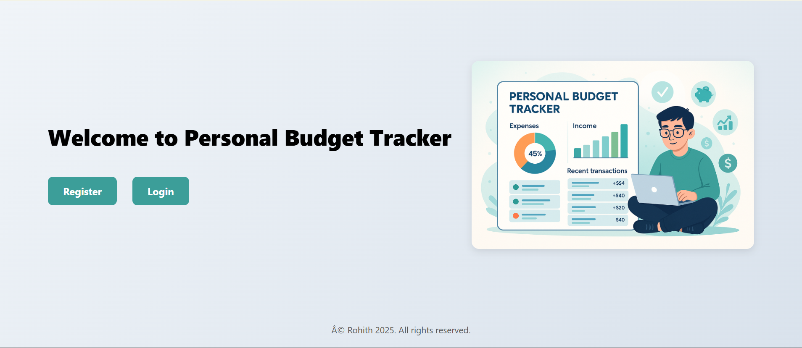

# 💰 Personal Budget Tracker

[](https://drive.google.com/file/d/1Qn3TDdZuQhSy1FOtNEYqqewJtcLzC4ze/view?usp=drive_link)
[](https://github.com/Matam-Rohith/personal_budget_tracker)


> A personal finance web app to track income, expenses, and savings with category-wise breakdowns, budget alerts, and visual reports.

---

## 🎥 Demo

[👉 Watch Demo Video](https://drive.google.com/file/d/1Qn3TDdZuQhSy1FOtNEYqqewJtcLzC4ze/view?usp=drive_link)

---

## ✨ Features

- 📊 **Category-wise Tracking** — Separate income and expense categories (food, rent, transport, etc.)
- 🚨 **Budget Alerts** — Get notified when spending exceeds set limits
- 📈 **Visual Reports** — Charts and graphs for spending breakdowns
- 📆 **Date-wise Transactions** — Filter and view transactions by date range
- 📱 **Responsive UI** — Works on mobile and desktop
- 💾 **Persistent Storage** — Data saved in LocalStorage

---

## 🛠 Tech Stack

| Layer | Technology |
|---|---|
| Frontend | HTML5, CSS3, JavaScript |
| Framework | AngularJS |
| Charts | Chart.js |
| Storage | LocalStorage |

---

## 🚀 Getting Started

```bash
# Clone the repository
git clone https://github.com/Matam-Rohith/personal_budget_tracker.git

cd personal_budget_tracker

# Open in browser
open index.html
```

---

## 📸 Screenshots



---

## 👨‍💻 Author

**Matam Rohith**  
[](https://rohith-portfolio-six.vercel.app/)
[](https://www.linkedin.com/in/matam-rohith-1418ab1b4/)

---

## 📄 License

This project is licensed under the [MIT License](LICENSE).
